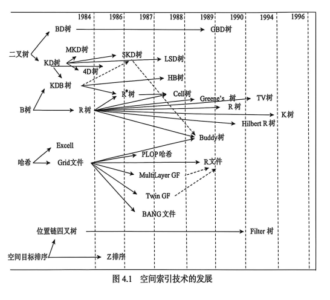
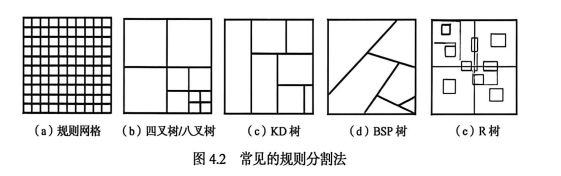
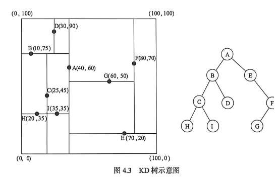
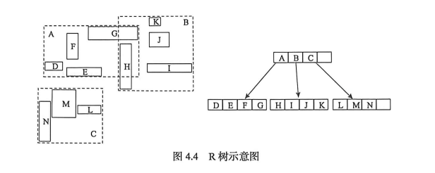
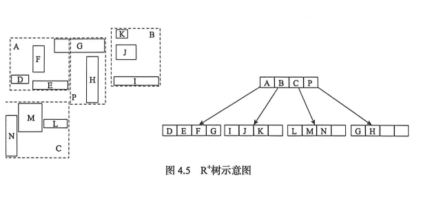
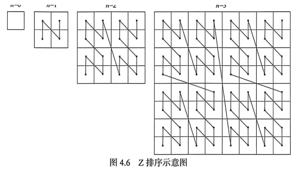
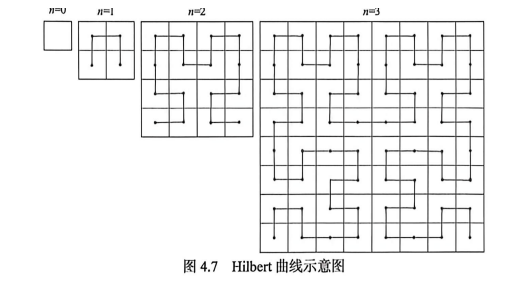
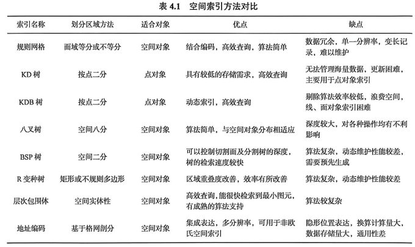

**4.1 空间索引概述**

地理空间数据操作包括地理要素编辑（增、删、改、位移、合并等）、图形显示（放大、缩小、漫游）、拓扑关系处理及各种查询和分析等，其中最广泛、最频繁的操作首推要素编辑和图形显示。既有单个实体操作（编辑），又有批量窗口检索（显示）。地理空间数据操作一般情况下基于内存，编辑操作完成后，一次性存入外存数据文件。当地理空间区域大、数据海量，内存存储容纳不下全部地理空间数据时，编辑操作只能基于外存工作。随着数据量增加，数据操作的效率会越来越慢，直到人们无法忍受，提高海量空间数据的操作效率成为人们关注的焦点。

## 4.1.1 空间索引的发展

空间索引的提出是由两方面决定的：其一是计算机的体系结构将存储器分为内存、外存两种，访问这两种存储器一次所花费的时间一般为 30～40ns、8～10ms，可以看出两者相差十万倍以上，尽管现在有“内存数据库”的说法，但绝大多数数据是存储在外存磁盘上的，如果对磁盘上数据的位置不加以记录和组织，每查询一个数据项就要扫描整个数据文件，这种访问磁盘的代价就会严重影响系统的效率，因此系统的设计者必须将数据在磁盘上的位置加以记录和组织，通过内存中的一些索引来取代对磁盘漫无目的访问，才能提高系统的效率。尤其是地理空间数据涉及的是各种海量的复杂数据，索引对于处理的效率至关重要。其二是地理空间数据多维性使得传统的 B 树索引并不适用，因为 B 树所针对的字符、数字等传统数据类型是在一个良序集之中，即都是在一个维度上，集合中任意两个元素，在这个维度上确定其关系只可能是大于、小于、等于三种，若对多个字段进行索引，必须指定各个字段的优先级形成一个组合字段，传统的数据库索引技术有 B 树、B+树、二叉树、ISAM 索引、哈希索引等，这些技术都是针对一维属性数据的主关键字索引而设计的，并不能直接应用于空间数据库领域。

而地理数据的多维性，在任何方向上并不存在优先级问题，因此 B 树并不能对地理数据进行有效的索引，所以需要研究特殊的能适应多维特性的空间索引方式。为了满足二维及多维空间数据快速检索与分析的需求，从 20 世纪 80 年代开始，空间索引技术开始兴起，空间索引的研究引起了国内外学者的足够重视，许多空间索引结构与方法相继提出 **（图 4.1）**。

地理空间索引就是指在存储空间数据时依据空间对象的位置和形状或空间对象之间的某种空间关系，按一定顺序排列的一种数据结构，其中包含空间对象的概要信息，如对象的标识、外接矩形及指向空间对象实体的指针。地理空间索引作为一种辅助性的空间数据结构，介于空间操作算法和空间对象之间，通过它的筛选，大量与特定空间操作无关的空间对象被排除，从而提高了空间操作的效率。

## 4.1.2 空间索引分类

空间索引的基本方法是将整个空间分割成不同的搜索区域，以一定的顺序在这些区域中查找空间实体。

### 1. 按搜索对象分类

根据搜索分割对象不同，可将空间索引分为三类，即基于点区域划分的索引方法、基于面区域划分的索引方法和基于三维体区域划分的索引方法。常见的基于点区域划分的索引结构有 KD 树（K-dimension tree）、B 树、KDB 树和点四叉树等；基于面区域划分的索引结构有区域四叉树、R 树系列和格网索引机制等；基于三维体区域划分的索引结构有 Morton 编码、无边界 Quad 编码、球面 QTM 编码及球面 HSDS 编码等。

### 2. 按分割法分类

按照空间分割方法，将空间分割分为对象分割法和规则分割法。

#### 1）对象分割法

在对象分割法中，索引空间的分割直接由空间要素确定，索引单元包括空间要素地址的参考信息和空间要素的外包矩形。对象分割法一般由层次包围体实现。层次包围体是一种简单的树结构，它用一些特定的方法对空间实体对象进行分割，最终将树的每一个结点保存为所在层次的包围体信息，叶子结点则存储基本对象。例如，当对两个物体做碰撞检测时，首先检测两者的包围体是否相交，若不相交，则说明两个物体未相交，否则进一步对两个物体进行检测。求包围体的交比求物体的交要简单得多，以便快速排除很多不相交的物体，从而加速检索算法。常见的包围体有五种：①包围球（spheres）。包围球是一种最简单的包围体，易于计算，非常易于做重叠测试和结点修改，但缺点是与物体的逼近程度较差。②轴向包围盒（axisaligned bounding box，ABB）。轴向包围盒是一种长方体的包围体，其各轴的方向与坐标轴的方向一致，它也是一种易于做重叠测试的包围体，但与物体的逼近程度较差。③方向包围盒（oriented bounding box，OBB）。方向包围盒是一个任意方向的长方体包围体，与前二者相比，它可提供非常紧凑的逼近效果，而且更新计算的效率较高。④离散方向多面体（discrete orientation polytopes，DOP）。离散方向多面体是一个凸多面体，它的面由一些半空间所确定，这些半空间的外法向是从 k 个固定的方向中选取的。与包围球和轴向包围盒相比，离散方向多面体对物体的逼近程度相对较好，与方向包围盒和凸包相比，它的重叠测试和结点修改耗费相对较低。⑤凸包（convex hull）。凸包是一种极端情况，它提供了物体最紧凑的凸包围体，但它的重叠测试和结点修改的耗费都相当高。

层次包围体的基本算法包括包围体的计算、分割和相交判断等。一般以上几种包围体（包围盒）的紧凑程度依次增大，但相应的计算复杂度也越来越高。

#### 2）规则分割法

规则分割法是将地理空间按照某种规则或半规则的方式进行分割，分割单元间接地与空间要素相关联，空间要素的几何形状可能被分割到几个相邻的单元中，这时空间要素的描述保持完整，而空间索引单元只存储空间要素地址的参考信息。规则分割法将空间按照某些规则分割成均匀的单元，然后将空间中每个实体对应到一个或多个单元中，这一方法很适于实体在空间中均匀分布的稀疏环境。但对于更为一般的环境，则很难选择一个最优的剖分尺寸，若选择不当，会导致空间耗费大，计算效率低。常用的空间剖分法有规则网格、KD 树、KDB 树、BSP（binary space partition）树、八叉树和 R 树系列等 **（图 4.2）**。

八叉树是对二维 GIS 中四叉树索引进行扩展的一种三维空间数据结构，其基本思想是将三维区域划分成三维栅格，每一个小正方体（称为一个体元）有一个或多个属性数据。属性相同的区域用大块表示，而复杂区域则用小块表示，以一大块分为八小块进行规则划分。建立八叉树索引的难点：一是空间分割时应遵循的原则，这可通过规定一个阈值 k（表示空间对象的个数）来解决，即只有当区域中空间对象的个数多于 k 个时，该区域才需要进一步划分；二是分辨率问题（即空间分割时允许达到的最小子区是多大），这可以通过规定一个不再需要分割的体元大小来解决。

### 3. 按技术分类

空间索引技术大致可分为四类：基于二叉树的空间索引技术；基于 B 树的空间索引技术；基于哈希格网的空间索引技术和基于空间目标填充曲线的空间索引技术。

#### 1）基于二叉树的空间索引技术

现实世界中的许多问题本身就是非线性结构的，难以用线性数据结构来描述，这些问题需要用非线性结构来描述。常见的非线性结构包括树结构、网络结构等。基于二叉树索引结构的空间索引的典型范例有 KD 树、KDB 树、SKD 树、LSD 树等。这一类的空间索引主要用于索引二维点和多维点数据，对于复杂的空间对象，如折线、多边形等则需要采用近似法或空间映射技术来进行近似组织，所以这一类的空间索引对于面向空间关系的查询和分析效率非常低。

最初的 KD 树专用于索引点数据，为了便于线、多边形等复杂空间要素索引建立，20 世纪 80 年代初提出了一种基于实体标志重复存储技术的 MKD 树空间索引技术；后来，为了能够将 KD 树存储组织扩展到外存，提出一种结合了 KD 树和 B 树的 KDB 树；之后，为了避免空间目标的重复存储和空间映射推出了 SKD 树，用空间目标的中心点来对空间数据集进行二分索引，在一定程度上提高了查询的效率 **（图 4.3）**。

#### 2）基于 R 树的空间索引技术

R 树是 B 树在多维空间的扩展，它具有 B 树的优点，如自动平衡、空间利用率高、适合于外存存储、查询效率高等 **（图 4.4）**。

B 树及其变体作为一种平衡的多路查找树，被广泛应用于常规的数据库管理系统之中，实践证明其对大型数据库的索引具有极出色的表现。基于 B 树的索引结构，具有 B 树的优点，如深度平衡、结点大小是磁盘页大小的整数倍、适合于以磁盘页为传输单位的数据处理系统等。目前在 GIS 领域广泛应用的空间数据索引技术，很多都是基于 B 树的，如 R 树及其两种变体 R*树和 R+树。

R*树在结构上与 R 树完全相同，只是在树的构造、插入、删除和检索算法上略有区别，R*树在构造和维护树时除了如 R 树一样考虑了目录矩形的面积这一因素外，还考虑了目录矩形的重叠（overlap）因素，即在数据分包的策略上与 R 树略有不同。正因为这一考虑，R*树在树的构造和维护上开销有所增加，但在检索性能和空间利用率上都得到了较大的提高。

R+树是 R 树的又一种变体。R+树通过裁剪数据矩形，使树的中间结点目录矩形的零重叠率成为可能，中间结构的目录矩形没有重叠，因此在这种索引结构下，点查询只有唯一的查询路径，区域和线的查询路径也大大减少，查询性能也得到很大的提高 **（图 4.5）**。

#### 3）基于哈希格网的空间索引技术

由于哈希索引能够通过哈希函数根据查找关键字来直接快速定位查询记录，因此哈希索引被广泛地应用于现有的数据库管理系统中。基于动态哈希格网方法的基本思路是将索引空间划分为规则的小方格网，与每个格网相关联的空间目标则存储在同一磁盘页，可以直接通过数组下标得到格网的访问地址以实现快速的空间目标查找。

基于哈希格网的空间索引实现思路比较简单，即通过划分规则方格网，建立空间对象与格网之间多对多的对应关系，在查询和空间分析时使用格网对数据进行初步过滤，以提高查询和分析的性能。

但由于哈希格网的空间索引建立的是多对多的对应关系，单元格的级数与数量由索引目标及索引目标的大小决定，所以当索引目标数据量很大或索引目标大小非常不均等时，索引空间经过多次细分，往往会产生大量的数据冗余，这无疑会增加查询时访问单元格的数量及查找时的外存访问，所以对于大型的空间数据库系统，基于哈希格网的空间索引效率不佳。

#### 4）基于空间目标填充曲线的空间索引技术

基于空间目标排序的索引方法的基本思想是按照某种策略将索引空间细分为许多均等的网格，并给每一网格分配一个编号，然后用这些编号为空间目标获得一具有代表意义的数字。这样，多维的空间目标就可以被映射成一维的目标，从而也就可以使用现有数据库管理系统中比较成熟的一维索引技术来提供对空间数据的快速查找和存取。

空间目标排序的技术很多，最常见的是基于 Z 排序（ZOrder）和 Hilbert 排序的空间索引技术，技术的区别在于建立的多维到一维的映射关系是否能够很好地保持多维空间目标间的邻近关系。

Z 排序技术基于空间填充曲线（space filling curve），它基于这样一种假设：任何属性值都可以用固定长度的比特位（bit）来表示，称为 k 比特位。沿着每一维值的最大数值是 $2^k$。它通过将数据空间循环分解到更小的子空间来获得对于给定的空间对象形状的近似数值表示，即通过对全局空间的不断细分，可以找到对每一个空间对象的最小包围网格的数值表示。Z 排序作为一种空间索引机制，已经被广泛用于多个商业化的空间数据库系统，如 Oracle Spatial、SuperMap SDX+等 **（图 4.6）**。

与 Z 排序类似，Hilbert 曲线也是一种空间填充曲线，它利用一个线性序列来填充全局空间，其构造过程如 **图 4.7** 所示。

从 **图 4.7** 可以看出，Hilbert 曲线中没有斜线，所以它的空间邻接性要优于 Z 排序曲线。这种空间邻接性的提高，会带来更少的磁盘访问，从而提高查询、分析及数据存取的效率。但与此同时，Hilbert 曲线算法的计算量要比 Z 排序复杂一些，在空间索引的构建和维护的代价上要高于 Z 排序。

## 4.1.3 空间索引对比分析

空间数据库技术发展至今，已经有多种空间索引技术被提出并被广泛应用，到底哪一种空间索引效率更高、更为优秀实难定论。上面提到的四种空间索引各有特点，根据数据和应用的具体情况选择合适的索引技术，才能在空间数据库应用中取得更令人满意的效果。下面对四类空间索引技术进行对比分析。

### （1）基于二叉树的空间索引技术

在实现思路上比较简单，但这种空间索引在应用上有很大的局限性，对点数据的索引效果较好，但对于线、多边形类型的空间数据则难以很好地管理起来，即使通过采用近似法或空间映射技术来进行近似组织，也难以提供令人满意的查询和分析效率。所以，基于二叉树的空间索引技术目前应用已经非常少了。

### （2）基于 B 树的空间索引技术

相对来说是发展得最深入、全面的空间索引技术，也是在空间数据库领域应用得最为广泛的空间索引技术。包括 R 树及其变体，在 Oracle Spatial、SuperMap SDX+等多种商用空间数据库产品中都有应用。对于点、线、多边形等多种类型的空间对象，基于 B 树的空间索引技术都能提供相当好的查询和分析性能。但基于 B 树的空间索引在进行空间目标的添、删、改时，索引树的维护算法复杂度很高，有时单个对象的修改甚至会导致整棵树的重新构建，所以基于 B 树的空间索引技术更适合用于相对静态的空间数据，即不频繁进行添、删、改等编辑操作的空间数据。

### （3）基于哈希的格网空间索引技术

是实现思路最简单的一类空间索引技术，索引的构造和查询的算法复杂度都很低。但面临的问题是网格与对象之间的多对多关系，在空间对象数量很大或空间对象的大小严重不均等时，会导致大量的索引数据冗余。另外，这种空间索引在查询区域较小时尚能提供较好的查询和分析效率，一旦查询区域很大时（如超过全局区域的四分之一）就会导致查询效率急剧下降，可以通过建立多层索引解决这种问题，但这又势必会进一步加剧索引数据的冗余。

### （4）基于空间目标填充曲线的空间索引技术

多用于四叉树索引，四叉树索引与 R 树索引互为补充，四叉树索引在查询性能方面不及 R 树索引，但对空间对象进行添、删、改等编辑操作时，四叉树索引中不需要分裂等全局操作，只需要修改当前对象的相关索引数据即可，所以四叉树索引的构建和维护代价相当低。在索引需要经常变更空间数据时，可以考虑使用基于空间目标填充曲线的空间索引技术。

基于上面的分析可以看出，各类空间索引技术都有其优点和缺点，没有一种索引结构在任何情况下都是有绝对优势的，根据实际应用需求，选择合适的方法，才能取得最佳的效果。

实用、高效的空间索引机制是 GIS 基础软件设计与开发需要解决的关键技术，是快速、高效地查询、检索和显示地理空间数据的基础。目前，国内外学者提出了多种三维空间索引方法，但还没有一种方法明显优于其他方法。因此，GIS 软件开发者必须针对自身应用需要，选择合适的空间索引方法。每一种空间索引方法都有其优越性、使用范围和适用对象。选取何种索引机制作为 GIS 空间数据库的空间索引，要根据实际情况和应用需要来确定。目前，多数 GIS 软件采用多种索引机制并存、取长补短的策略。 **表 4.1** 是在对各种类型索引研究的基础上归纳出来的索引综合性能对照表，对实际应用具有参考意义。

## 4.1.4 空间索引研究内容

目前，空间数据库索引技术还处在不断的发展和完善阶段，空间数据库索引技术及基于它们的空间数据查询还有很多问题需要进一步解决和完善，包括但并不限于以下方面：①高效索引树算法的改进；②复杂空间查询方法的优化；③查询操作中几何过滤方法；④动态索引结构的建立；⑤应用于三维、多媒体或更高维数据的高维空间索引技术；⑥面向空间关系的空间索引技术；⑦基于并行计算和网格计算的空间索引技术；⑧面向空间数据仓库的空间索引技术；⑨面向时空间数据库的空间索引技术。

由于空间索引技术与非空间索引技术相比要复杂得多，不同的应用系统要求的空间索引技术可能很不相同，必须对应用系统的空间对象有很好地理解，才能设计出高性能的索引机制，因此说较通用的空间索引技术研究还不成熟。目前，空间索引研究较多局限于二维、三维空间对象，而对高维空间索引技术研究比较少。随着计算机硬件技术的发展，空间索引的分布化或并行化正成为一种崭新的研究思路，这将成为今后空间索引研究的一个新的热点。
