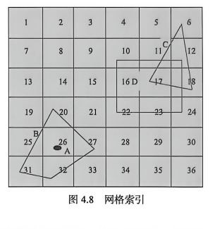
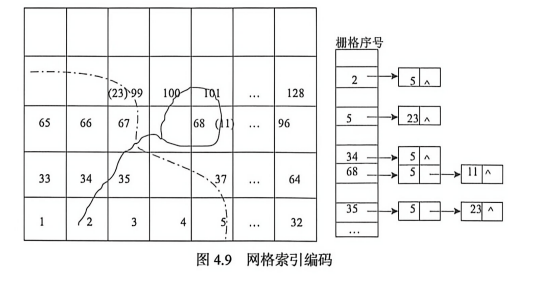
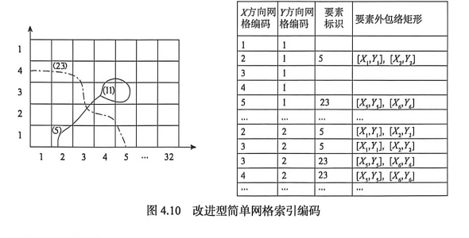
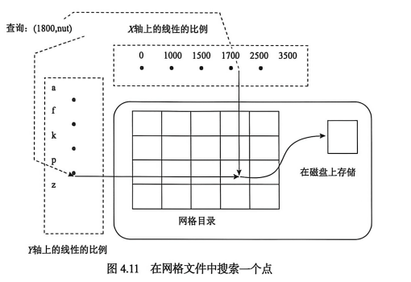
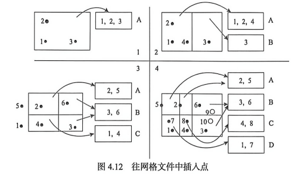

**4.2 网格索引**

规则格网空间索引的思路清晰，容易理解和实现，其基本思想是将研究区域用横竖线划分为大小相等或不等的网格，记录每一个网格所包含的地理对象，当用户进行空间查询时，首先计算出查询空间要素所在的网格，然后通过该网格快速定位到所选择的空间要素，将空间格网与空间对象的关系转换为索引的线性表。当用户进行空间查询时，首先计算出用户查询对象所在的网格，然后通过该网格快速查询所选地理对象。规则格网空间索引的查询速度快，但数据量大时索引维护较为困难。

## 4.2.1 网格索引原理

格网空间索引的原理比较简单，它把目标空间实体集合所在的空间范围划分成一系列大小相同的网格，即把空间位置进行网格化。根据每个实体的空间位置及其所占据的空间范围把实体网格划分成不同的部分，每一个格相当于一个桶（bucket），都记录着落入该格内的空间实体的编号（数据项），每一部分对应的网格分别增加新的记录以反映当前处理的实体 **（图 4.8）**。

评价网格索引性能的指标包括：网格大小、网格索引表记录数、网格索引表记录数与实体记录数的比率、平均每格的实体数、最大每格的实体数、完全分布在一个网格中的实体百分比。

这些指标中最关键的就是网格大小，它制约和影响着其他指标。网格越大，网格索引表记录数越少，越与实体记录数相接近，进而影响网格索引表记录数与实体记录数的比率，但是平均及最大每格的实体数也会越大，完全分布在一个网格中的实体百分比也会越高；反之，网格越小，就会造成网格索引表中记录数越大，但平均及最大每格的实体数会相对变少，完全分布在一个网格中的实体百分比也会降低。

### 1. 传统简单网格索引编码

建立地图数据库时需要用一个平行于坐标轴的正方形数学网格覆盖在整个数据库数值空间上，将后者离散化为密集栅格的集合，以建立制图物体之间的空间位置关系。通常是把整个数据库数值空间划分成 32×32 或 64×64 的正方形网格，建立另一个倒排文件——栅格索引。每一个网格在栅格索引中有一个索引条目（记录），在这个记录中登记所有位于或穿过该网格的物体的关键字，可用变长指针法或位图法实现 **（图 4.9）**。

### 2. 改进型简单网格索引编码

改进型单元网格索引将传统型编码由一维升至二维，变成 X 方向和 Y 方向上的编码，将空间要素的标识、空间要素所在网格的 X 方向和 Y 方向上的编码，以及空间要素的外包矩形作为一条数据库记录存储。如果一个空间要素跨越多个网格，则同样存储多条记录 **（图 4.10）**。

## 4.2.2 网格索引算法

网格索引的算法步骤：

### （1）创建

通过数据的统计特征计算出一个网格尺度，对每一个实体按网格进行分解，在其落入的所有网格中追加该实体记录，直到所有的实体处理完毕。

### （2）重建索引

随着数据表中实体的编辑、增加及删除，重新对数据进行统计计算，获得新的网格尺度，从而重建网格索引。

### （3）查询

网格索引的查询操作就是对原空间数据利用网格索引进行检索的过程，它可以分成两步进行，即粗略查询过程和精确查询过程。通过对查询区域进行分区，检索出所有被查询区域覆盖且包含实体的网格，实现首次粗略查询；在粗略查询结果集合基础之上通过精确比较，剔除不满足查询要求的记录。

### （4）插入

插入空间实体时，根据每个格的大小，按规则计算出这个实体跨越哪些格，并计算出空间要素的网格编码，然后在格网结构索引表的那些格中记录该实体的数据项。

### （5）删除和更新

删除实体记录，并把此反映到网格索引中比较复杂，需要删除所有该实体对应的索引记录。在关系数据库中，通过对索引表中的“实体号”字段建立索引，可以大幅度提高这一操作的性能。

## 4.2.3 网格索引文件

网格索引文件一般采用二维数据的网格文件结构，该结构可以推广到任意维。网格文件依赖于网格目录识别出包含所需要的点的数据页。网格目录类似于用在可扩展哈希中的目录。当搜索一个点的时候，首先找到网格目录中相应目录项。网格目录中的目录项就像点的存储页的可扩展哈希目录中的目录项一样，如果点存储在数据库中的话。

网格文件使用与坐标轴平行的线将空间分为矩形区域，通过说明坐标轴上的分割点就可以描述网格文件的划分。如果 X 轴被分割成十个部分，Y 轴被分割成九个部分，那么总共有对应的划分。网格目录是一个二维数组，每个划分是一个目录项。这些信息存储在一个称为线性比例的数据结构中，每个坐标轴都有一个线性比例。

**图 4.11** 说明了如何使用网格文件索引来搜索一个点。第一步，使用线性比例来找出给定点的 X 值所在的段，以及 Y 值所在的段，这将识别出给定点的网格目录的目录项。假定所有的线性比例都存储在主存中，因此这一步不需要磁盘 I/O。下一步，提取网格目录项。网格目录也许太大不能装到内存中，而需要存储在磁盘中。然而，由于网格目录的目录项是按行或列的顺序来排序的，所以可以找出给定目录项所在的页，只需一次磁盘 I/O 就可以读取它。网格目录的目录项给出包含所需点的数据页的 ID，利用这个 ID 再需一次磁盘 I/O 检索出需要的页。这样，通过两次磁盘 I/O 就检索出一个点：一次 I/O 用于目录页，另外一次用于数据页。

网格文件依赖于这样一个性质：一个网格目录的目录项指向包含所需数据点的数据页，如果点在数据库中的话。这意味着如果一个数据页是满的，而且有新点要插入该页中，则需要分裂网格目录及与被分裂维对应的线性比例。为了有效地利用空间，允许几个网格目录的目录项指向同一页。也就是说，空间的几个划分可以映射到同一个物理页，只要所有这些划分中的点集合适合在一个单独的页中存储。

将点插入网格文件中，如 **图 4.12** 所示，它有四个部分，每个部分都是网格文件的一个快照。每个快照只显示一个网格目录和数据页，为了简化，省略掉了线性比例。开始时，图的左上部分只有三个点，所有点都能放到一个单独的页 A 里。网格目录只包含一个目录项，它覆盖整个数据空间，指向数据页 A。

在本例中，假定一个数据页的容量是三个点。这样，当要插入一个新的点时，就需要另外一个数据页。为了得到一个新的目录项指向新的页，网格目录也被迫分裂。为此，需要沿着 X 轴进行划分来获得两个相等的区域，其中一个区域指向页 A，另外一个指向新数据页 B。数据点在 A 页和 B 页上重新分布以反映网格目录的划分。

**图 4.12** 的左下部分说明了两次插入以后的网格文件。点 5 的插入使得重新划分网格目录，因为点 5 在指向页 A 的区域中，而页 A 已经是满的。因为前面的分裂是沿着 X 轴划分的，所以现在沿着 Y 轴进行划分。接着插入点 6 是直接的，因为它在指向页 B 的区域中，而页 B 有空间容纳新的点。

接下来考虑 **图 4.12** 的右下部分。它表明了插入两个点 7 和 8 以后的示例文件。点 7 的插入使得页 C 成为满的，随后点 8 的插入引起了一次新的分裂。这一次，沿着 X 轴进行分裂，然后将页 C 中的点分布到 C 和新页 D。可以看到，网格目录在越是包含多数点的数据空间部分，就越是被划分，同时划分对数据分布是敏感的，也能处理倾斜的划分。

最后，考虑点 9 和点 10 的潜在插入，它们显示为圆，以表示这些插入的结果没有反映到数据页中。插入点 9 填充在页 B，接下来点 10 的插入需要新的页。然而，网格目录没有必要进一步划分，点 6 和点 9 可以在页 B 中，点 3 和点 10 可以移到新的页 E 中，同时指向页 B 的第二个目录项可以重新设置为指向页 E。

从网格文件中删除点是比较复杂的。当一个数据页低于某个占有阈值时，如少于一半，它就必须与其他某一个页进行合并以保持良好的空间利用率。为了简化删除，对于指向单个数据页的网格目录集合要有凸面，即由网格目录项的集合定义的区域必须是凸的。

虽然有两种基本的方法来处理网格文件中的区域数据，但没有一种是令人满意的。第一种方法是用高维空间中的点来表示一个区域，例如通过存储矩形的对角点可以把二维空间中的矩形表示为四维空间中的点。这种方法不支持最近邻查询和空间连接查询，因为原始空间中的距离不能反映为高维空间中的点之间的距离。第二种方法是在每个覆盖区域对象的网格划分中存储一条表示区域对象的记录。这也不能令人满意，因为它导致了许多附加记录，使得插入和删除更加麻烦。总的来说，网格文件不是存储区域数据的好结构。

## 4.2.4 网格索引分析

使用网格索引可以很容易地解决区域查询和最近邻查询。对于区域查询，使用线性比例确定要读取的网格目录的目录项集合。对于最近邻查询，首先检索出给定点的网格目录的目录项，然后搜索它所指向的数据页。如果这个数据页是空的，再使用线性比例来检索与包含查询点的划分最接近的网格划分所对应的数据项。在所有这些划分中检索所有的数据点，并检查它们对于给定点是否邻近。

网格索引存在很严重的缺陷。当被索引的图元对象是线或者多边形的时候，存在索引的冗余，即一个线或者多边形的引用在多个网格中都有记录。随着冗余量的增大，效率明显下降。所以，很多学者提出了各种方法来改进网格索引。点图元非常适合网格索引，不存在冗余问题。
