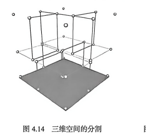
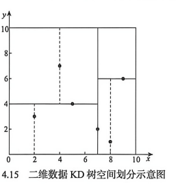
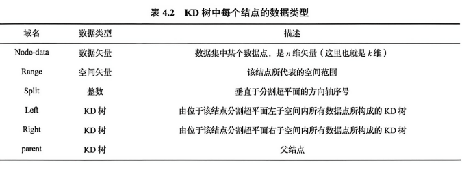
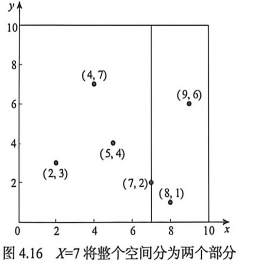
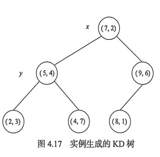
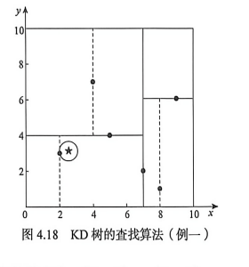
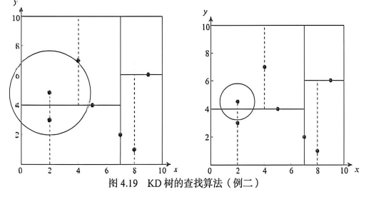

## KD 树

### 定义
多维空间分割树(K-dimension tree,KD树)，也叫多维搜索二叉树，是对数据点在 k 维空间划分的一种数据结构

### 特点
- 是一种平衡二叉树，是将二叉树推广到多维数据的一种主存数据结构，它是一个 K 维空间中的二叉树
- KD 树从空间角度看待存储的数据，KD 树的基本形式存储 K 维空间点，并采用树形结构划分和组织场景空间。当存储二维数据时，存储空间就是一个二维平面

### 数据结构
KD 树是二进制空间分割树。KD 树的每个内部结点都包含一个点，并且和一个矩形区域相对应。树的根结点和整个研究区域相对应。树中奇数层次上的点的 X 坐标和偶数层次上的点的 Y 坐标把矩形区域分成两部分。在 KD 树结构中，通过沿着树下降到达一个树叶结点的方式来添加一个新点。KD 树的查找是从根结点开始的，查看所存储的结点（分裂的点）是否被包括在查找范围内，以及和左子树或者右子树是否有交叉。对于每个和查询范围交叉的子树，查询过程将重复执行直到到达树叶为止。

KD 树按照一定的划分规则把空间划分为多个空间，如 **图 4.14** 所示。这里假设有若干二维数据点位于二维空间内。KD 树算法就是要确定这些分割空间的分割线，多维空间即为分割平面，一般为超平面。**图 4.15** 展示 KD 树是如何确定这些分割线的。





KD 树是一个二叉树，每个结点表示的是一个空间范围。**表 4.2** 是 KD 树每个结点中主要包含的数据类型。



Range 是表示结点所在的空间范围，Node-data 是该结点数据集中的一个数据点，Split 是分割方向，KD 树中每个结点的分割方向可以按照 X、Y 方向交替，形成对空间的二叉划分。

假设有 6 个二维数据点，位于二维空间内，对这 6 个数据点进行 KD 树的构建，效果如 **图 4.16** 和 **图 4.17** 所示。**图 4.16** 是实际分割效果，**图 4.17** 是所构成的 KD 树，x、y 代表的是当前结点的分割方向。





k-d 树是一棵二叉树，每个结点表示一个 $k$ 维点。每个非叶结点隐式生成一个分割超平面，将空间划分为两个半空间：超平面左侧的点归入左子树，右侧的点归入右子树。

每个结点关联 $k$ 个维度中的一个，分割超平面垂直于该维度的坐标轴。例如以 $x$ 轴作为当前分割维度时，$x$ 坐标较小的点进入左子树，较大的点进入右子树。

### 查找
KD 树查找时，从根结点开始，依次比较当前结点和目标点的距离，同时判断搜索圆是否与另一侧子空间相交。如果搜索圆不与另一侧空间相交，则不需要搜索另一侧子树；如果相交，则必须回溯到另一侧子树继续查找。**图 4.18** 与 **图 4.19** 展示了 KD 树最近邻查找的两个示例。





## KD树的应用

### 范围搜索

范围搜索用于查找各维参数落在指定区间内的点。由于 k-d 树在每一层对一个维度的范围进行划分，它适合执行正交范围查询。对包含 $n$ 个结点的 $k$ 维 k-d 树，范围搜索的最坏时间复杂度为：

$$
t_{\text{worst}}=O\left(k\cdot n^{1-\frac{1}{k}}\right)
$$

### 最近邻搜索
最近邻搜索利用分割平面剪除不可能包含更近点的子树：

1. 从根结点开始，按照查询点在当前分割维度上的坐标递归进入一侧子树。
2. 到达叶结点后计算距离，并记录当前最优点。
3. 回溯递归路径，在每个结点执行以下操作：
    1. 如果当前结点更近，则更新最优点。
    2. 判断以查询点为中心、当前最优距离为半径的超球面是否与分割超平面相交。
    3. 如果相交，继续搜索另一侧子树；如果不相交，则剪除另一侧整棵子树。
4. 处理完根结点后，搜索结束。

实现中通常比较距离的平方，以避免反复计算平方根。维护多个当前最优点即可扩展为 $k$ 近邻搜索；限制检查点的数量或搜索时间，则可得到近似最近邻搜索。

### 点云组织


## KD树的操作

### 构建

- 随树深度增加，循环选择分割轴。例如三维空间依次使用 $x$、$y$、$z$ 轴，然后重新从 $x$ 轴开始。
- 在当前分割轴上选择点集的中位点作为结点，并将其余点分配到左右子树。

选择中位点通常能得到较为平衡的树，但平衡树不一定适合所有应用，也不是构建 k-d 树的必要条件。如果不选择中位点，则不能保证树的平衡性。

```text
function kdtree(pointList, depth)
{
    // 根据深度循环选择分割轴
    axis := depth mod k

    // 根据当前轴选择中位点
    median := select median by axis from pointList

    node.location := median
    node.leftChild := kdtree(points before median, depth + 1)
    node.rightChild := kdtree(points after median, depth + 1)
    return node
}
```

该算法维持如下不变量：任意结点左子树中的点位于分割平面的一侧，右子树中的点位于另一侧。位于分割平面上的点可根据实现规则放在任意一侧。还可以预先按各维度排序，并在递归构建过程中维持排序结果，避免每层重复寻找中位点。

### 添加元素

向 k-d 树添加新点与向普通搜索树插入元素类似。从根结点开始，根据待插入点位于当前分割超平面的哪一侧进入左子树或右子树，到达插入位置后将新点添加为左子结点或右子结点。

持续插入可能使树失衡并降低查询性能。退化速度与新增点的空间分布、新增点数量和原树规模有关。树过度失衡时，需要重新平衡以恢复最近邻搜索等操作的性能。

### 删除元素

删除结点时必须保持空间划分不变量。一种直接方法是收集目标结点各子树中的结点和叶子，然后重建这一部分树。

另一种方法是寻找替代点。若待删除结点 $R$ 是叶结点，可以直接删除；否则，从以 $R$ 为根的子树中选择替代点 $p$，用 $p$ 替换 $R$ 中的点，再递归删除原位置上的 $p$。如果 $R$ 当前按 $x$ 维划分且存在右子树，可选择右子树中 $x$ 值最小的点；如果不存在右子树，则选择左子树中 $x$ 值最大的点。

### 平衡

k-d 树按多个维度组织数据，普通二叉搜索树的树旋转可能破坏空间划分不变量，因此不能直接用于平衡 k-d 树。常见的平衡或动态变体包括 divided k-d tree、pseudo k-d tree、K-D-B-tree、hB-tree 和 Bkd-tree。


## 性能
### 高维数据导致的性能退化

对于随机分布的低维点，最近邻搜索的平均复杂度通常可达到 $O(\log n)$。随着维度升高，维数灾难会迫使算法访问更多分支。当点数只略多于维数时，k-d 树可能仅比线性扫描稍好。

通常希望数据量满足 $n\gg 2^k$。否则，高维查询可能检查树中的大多数点，效率接近穷举搜索；需要快速获得足够好的结果时，可考虑近似最近邻方法。

### 查询点远离树中各点导致的性能退化

即使在低维空间，如果查询点到各近邻点的距离十分接近，最近邻搜索也可能退化到接近线性扫描。例如，所有点均匀分布在以原点为中心的球面上时，从原点查询最近邻需要检查大量等距点。

一种缓解办法是为搜索设置最大距离。当某个分支不可能包含最大距离以内的点时直接剪枝。此时查询可能返回“未找到近邻”，表示指定距离范围内不存在候选点。

### 复杂度

- 从 $n$ 个点构建静态 k-d 树：
  - 每层使用 $O(n\log n)$ 排序寻找中位点时，最坏复杂度为 $O(n\log^2 n)$。
  - 每层使用 $O(n)$ 中位数选择算法时，最坏复杂度为 $O(n\log n)$。
  - 预先在 $k$ 个维度上分别排序并维持顺序时，最坏复杂度为 $O(kn\log n)$。
- 向平衡 k-d 树插入一个新点的时间复杂度为 $O(\log n)$。
- 从平衡 k-d 树删除一个点的时间复杂度为 $O(\log n)$。
- 平衡 k-d 树的轴平行范围查询复杂度为 $O(n^{1-1/k}+m)$，其中 $m$ 为返回点数。
- 对随机分布点，在平衡 k-d 树中查找一个最近邻的平均复杂度为 $O(\log n)$。

## 变体

### 体积对象

k-d 树除了存储点，也可以存储矩形或超矩形。此时范围搜索转化为寻找所有与查询矩形相交的对象，矩形通常存储在叶结点中。执行正交范围搜索时，可根据对象坐标和中位值判断某一分支是否能够剪除。

### 仅在叶结点中存储点

也可以只在叶结点中存储数据点，从而采用不同于标准中位数划分的策略。中点划分规则选择当前搜索空间最长轴的中点，不考虑点的实际分布；这种方法可限制区域的长宽比，但树深仍取决于数据分布。

滑动中点规则仅在分割线两侧都有点时按中点划分，否则将分割位置滑动到最靠近中点的数据点。该方法可为常见数据集提供较好的实际性能，并支持近似最近邻和近似范围计数。


## 开源实现

### [kdbush](./开源实现/kdbush/)

> 一种基于扁平 KD 树的二维点静态空间索引算法。


## 参考资料

- [Wikipedia：K-d_tree](https://en.wikipedia.org/wiki/K-d_tree)
- 《地理空间数据库原理（第二版）》崔铁军
