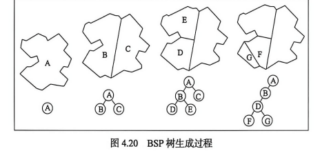

## 4.3.3 BSP 树索引

BSP 树即二叉空间分割树。其基本思想是，每个树结点都对应空间的一个区域，用一条直线或一个平面对区域进行二分，左子结点和右子结点分别表示分割后的两个子区域。通过递归分割，最终形成一棵空间分割树。

BSP 树的生成通常从整个空间区域开始，选择一个分割线或分割面，将空间划分为两个子区域，再对每个子区域继续划分，直到满足停止条件。父结点实际上代表整个区域，子结点代表被分割出的子区域 **（图 4.20）**。

BSP 树能够较好地表示空间对象之间的分割关系和相对位置关系，适用于空间场景组织、可见性判断和空间搜索等问题。它的不足是树的构造依赖于分割线或分割面的选择，若选择不当，树的深度会增大，检索效率会受到影响。
