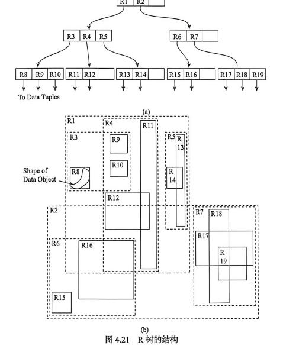

**4.4 R 树索引**

R 树是处理多维数据的一种动态索引方法，它可被看作 B 树在多维空间中的扩展。R 树用最小外包矩形组织空间对象，结点中的每个条目包含一个矩形范围和一个指向子结点或空间对象的指针。由于空间对象往往不是一个点，而是线、面或其他复杂形态，R 树通过外包矩形把复杂对象近似为可比较、可组织的矩形范围。

## 4.4.1 R 树定义

R 树是一种高度平衡树。它适合存储空间对象的外包矩形，并通过层层嵌套的矩形组织空间对象。叶子结点保存空间对象或对象标识，非叶子结点保存子结点外包矩形和指向子结点的指针。一个结点中的所有条目对应的外包矩形构成父结点的覆盖区域。

R 树满足类似 B 树的平衡要求：所有叶子结点位于同一层，除根结点外每个结点的条目数有上、下界，根结点至少包含两个子结点。插入和删除操作会引起结点分裂、合并或重新调整，从而保持索引树的平衡。

**图 4.21** 展示了 R 树的结构，展示了可能存在于矩形之间的包含和覆盖现象。图中假设所有数据都是二维空间下的点，矩形区域用于组织这些点所在的空间范围。

## 4.4.2 R 空间索引分类

R 树提出以后，围绕插入、分裂、搜索和删除等操作形成了多种改进型索引结构。R 树系列中常见的改进包括 R+树、R*树等。R+树通过避免中间结点矩形的重叠来提高点查询和范围查询效率，但会导致对象在多个结点中重复出现；R*树通过优化插入和分裂策略，综合考虑面积、周长和重叠度，减少查询时需要访问的结点数量。

R 树系列的核心问题是如何在结点容量、矩形面积、重叠度和查询代价之间取得平衡。空间对象越复杂，外包矩形之间越容易重叠；重叠越多，查询时需要访问的路径越多，检索效率越低。因此，R 树算法通常会尽量减少目录矩形面积和相互重叠。

## 4.4.3 R 树存在问题

R 树能够有效组织点、线、面等空间对象，适合动态空间数据库。但 R 树也存在一些问题：

### （1）目录矩形重叠

R 树的非叶结点目录矩形之间可以相互重叠。查询区域一旦与多个目录矩形相交，就需要沿多条路径向下搜索，导致磁盘访问次数增加，查询效率下降。

### （2）空间利用率与分裂代价

插入新对象时，如果结点已满就需要分裂。不同分裂策略会影响树的高度、结点空间利用率和目录矩形重叠度。为了获得较好的检索性能，分裂算法通常较复杂。

### （3）动态维护复杂

当空间对象频繁插入、删除或更新时，R 树需要不断调整结点和目录矩形。某些情况下，一个对象的改变可能引起路径上多个结点的矩形调整，甚至导致局部或整体结构重组。

### （4）对象形状近似误差

R 树使用最小外包矩形近似复杂空间对象。对于形状狭长、弯曲或分布不规则的对象，外包矩形可能包含大量空白区域，导致过滤效果下降，增加后续精确几何判断的代价。
