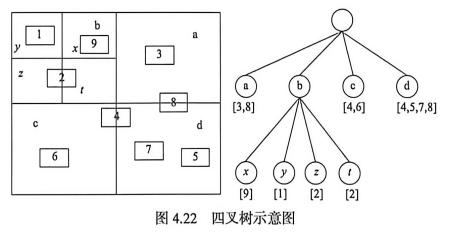
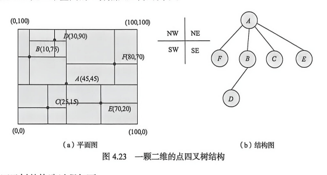
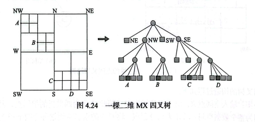
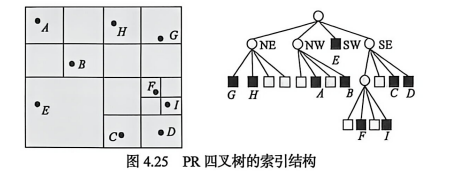
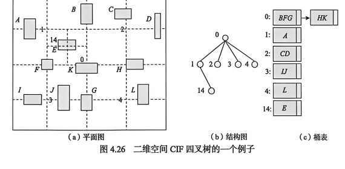
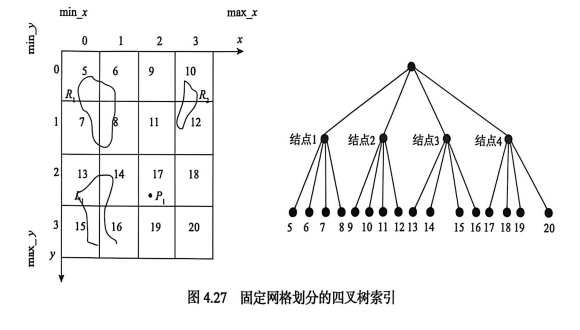
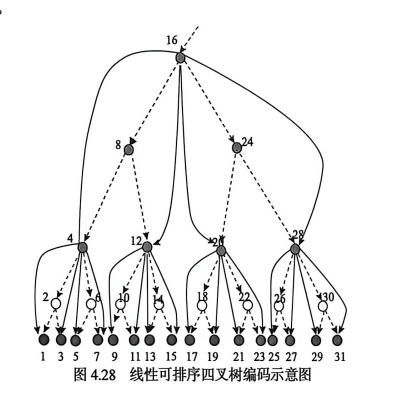

**4.5 四叉树索引**

四叉树是将二维空间递归划分为四个子空间的一种树形结构。每个结点代表一个空间区域，若该区域还需要进一步细分，则继续划分为四个象限。四叉树索引结构简单，便于实现，常用于栅格数据、点数据、区域数据和动态空间对象的组织。

## 4.5.1 四叉树索引说明

四叉树索引的基本思想是将研究区域逐级划分为四个象限：NW、NE、SW、SE。每个象限可以继续递归划分，直到满足给定条件，如达到最小网格尺寸、对象数量低于阈值或区域内部对象分布足够简单。不同类型的空间数据可形成不同类型的四叉树索引。

四叉树常用于将区域进行层次分解。对于同一个区域，采用不同划分策略或不同终止条件，可能得到不同的树形表示，但它们对应的空间划分结果仍然表示相同的多边形 **（图 4.22）**。

## 4.5.2 点四叉树索引

点四叉树用于组织二维空间中的点对象。每个结点保存一个点，并以该点为分割点把空间划分为四个象限，分别对应 NW、NE、SW、SE 四棵子树。新点插入时，从根结点开始，比较它与当前结点的相对位置，选择对应象限继续向下，直到找到合适的位置。

点四叉树具有插入和查询直观的特点，适合分布较均匀的点数据。它的不足是树的形态受插入顺序影响较大，当点分布不均匀或插入顺序不理想时，树可能变得很深，导致查询效率下降。**图 4.23** 是二维空间的一棵点四叉树的例子。

## 4.5.3 区域四叉树索引

区域四叉树将空间区域按照规则网格递归划分，每个结点对应一个空间块。若某个空间块完全为空或完全被某类区域覆盖，则该结点成为叶子结点；若空间块内部情况复杂，则继续划分为四个子块。区域四叉树适合表示栅格区域、二值图像和面状对象。

### 1. MX 四叉树

MX 四叉树按固定网格层次对空间进行递归划分。每一层划分都将父区域分成四个大小相等的子区域，直到达到预定分辨率或区域内部状态一致为止。MX 四叉树可以用来表示某一个位置空间点存在与否。**图 4.24** 是二维空间的一棵 MX 四叉树的例子。

### 2. PR 四叉树

PR 四叉树是一种点区域四叉树。每个叶子结点通常保存一个点或少量点，当一个区域中的点数超过给定容量时，该区域被划分为四个子区域。PR 四叉树的结点划分位置不依赖于已有点的位置，而依赖于空间区域本身的规则划分。

PR 四叉树适合点对象索引。其优点是结构规则，便于范围查询；不足是当点分布高度不均匀时，某些局部区域可能被反复划分，导致树深增加。PR 四叉树中一棵子树代表该区域的四分之一 **（图 4.25）**。

### 3. CIF 四叉树

CIF 四叉树用于组织矩形对象。它以区域划分为基础，把空间中的矩形对象放入能容纳该对象的最小四叉树结点中。对于跨越多个子区域的矩形对象，可以存储在较高层次的结点中，以避免在多个子区域中重复记录。

CIF 四叉树能够较好地处理矩形对象，但对象大小差异较大时，树的层次和结点负载会不均衡。**图 4.26** 是二维空间 CIF 四叉树的一个例子。

## 4.5.4 基于固定网格划分的四叉树索引

固定网格划分的四叉树索引将空间区域按固定层次进行四叉划分。每一层网格大小固定，空间对象根据其覆盖的网格单元进行记录。对于点对象，通常只落入一个叶子单元；对于线和面对象，可能跨越多个单元，因此需要在多个网格中保存对象引用，形成重复记录 **（图 4.27）**。

这种方法结构规则、实现简单，适合静态或更新不频繁的空间数据。其不足是分辨率选择困难：网格过粗时过滤效果差，网格过细时索引记录数量大、维护代价高。

## 4.5.5 线性可排序四叉树索引

线性可排序四叉树索引将四叉树结点按照某种空间填充编码转换成一维序列，从而利用一维索引技术组织空间对象。通过对每个空间块进行编码，可以把二维区域映射到线性键值上，使四叉树结点具有可排序性。

线性可排序四叉树常采用 Morton 编码或类似编码方式。编码过程通常从根区域开始，按象限顺序为每一层子区域赋码，逐层连接得到空间块的线性编码。这样，空间邻近的块在编码上通常也比较接近，便于快速检索和存储管理 **（图 4.28）**。

线性可排序四叉树索引的优点是便于使用传统数据库中的一维索引结构，索引文件组织简单；不足是空间邻近关系在一维编码中不能总是完全保持，某些相邻区域可能在编码上相距较远。
