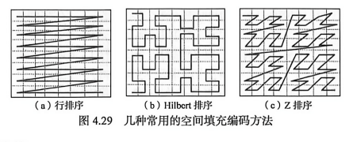
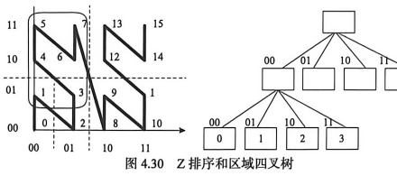

**4.6 空间填充曲线**

空间填充曲线是一类能够遍历二维或多维空间的曲线。它把多维空间中的单元按照一定顺序映射到一维序列中，使得空间对象可以用一维键值组织和检索。空间填充曲线常用于空间索引、空间数据库编码、图像处理和多维数据降维。

## 4.6.1 空间填充曲线概念

空间填充曲线最早由 Peano 在 1890 年提出，随后 Hilbert 等学者提出了多种不同的曲线构造方法。它们共同的目标是用一条连续曲线尽可能覆盖整个空间，并尽量保持空间邻近对象在一维序列中的邻近性。

在空间数据库中，空间填充曲线用于将二维或多维网格单元转换为一维编码。每个空间单元被赋予一个编码值，空间对象可以根据其所在单元或覆盖单元集合得到对应编码。这样，空间数据就可以借助传统数据库中成熟的一维索引结构进行管理。

常见的空间填充编码方法包括行扫描编码、Z 排序、Hilbert 曲线等。不同编码方法的差别主要在于扫描顺序和保持空间邻近性的能力 **（图 4.29）**。

## 4.6.2 Z 排序曲线

Z 排序也称 Morton 排序。它通过交错组合各维坐标的二进制位来形成一维编码。对于二维空间中的一个网格单元，其 X 坐标和 Y 坐标可以分别表示为二进制序列，将两个序列的位交错排列，就得到该单元的 Z 值。

Z 排序的关键是理解它如何将数据空间递归分解成象限和子象限。如 **图 4.30** 所示，区域四叉树的划分过程与 Z 排序编码过程具有对应关系。根区域被划分为四个象限，每个象限对应一个二进制前缀，继续划分时在原前缀后追加新的象限编码。

在 **图 4.30** 中，考虑根结点的孩子。所有对应于孩子象限中的点集的 Z 值都以对应象限的编码前缀开始。继续向下划分时，编码逐层增加。通过这种方式，二维空间中的对象被转换为一维的 Z 值序列。

Z 排序的优点是计算简单，编码和解码效率高，并且与四叉树划分方式关系密切，适合数据库索引实现。其不足是空间邻近性保持不如 Hilbert 曲线好，在某些位置上，相邻空间单元可能在 Z 值上相距较远。

## 4.6.3 Hilbert 曲线

Hilbert 曲线也是一种典型的空间填充曲线。与 Z 排序相比，Hilbert 曲线在遍历空间时具有更好的连续性和邻近性，它尽量避免扫描路径在空间中发生大跳跃。因此，使用 Hilbert 曲线编码的空间对象，在一维序列中的相邻关系通常更能反映原空间中的相邻关系。

Hilbert 曲线的构造采用递归方式。低阶曲线首先填充一个简单的网格；当阶数增加时，每个子网格内部再放置旋转或翻转后的 Hilbert 曲线，并通过端点连接起来，形成更高阶的曲线。随着阶数增加，曲线逐渐覆盖更细粒度的空间网格。

Hilbert 曲线的优点是空间聚集性较好，可减少范围查询和邻近查询时访问的磁盘页数量；不足是编码算法比 Z 排序复杂，构造和维护的计算代价较高。实际应用中，应根据数据分布、查询类型和维护成本选择合适的空间填充曲线。
